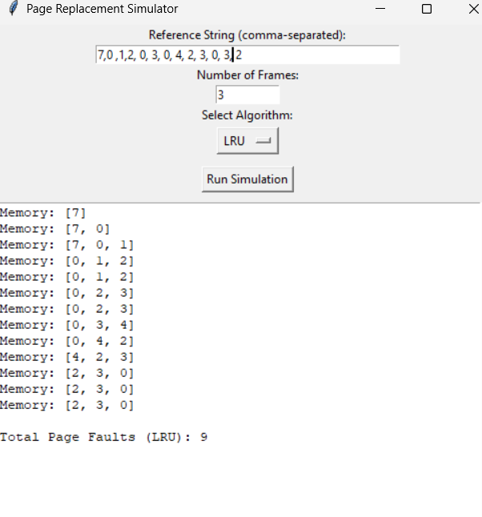
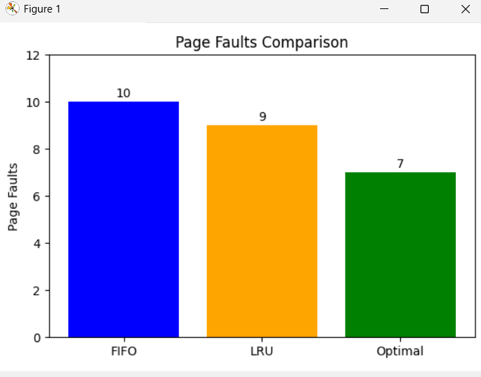

# Page Replacement Algorithm Simulator (with GUI)

This project simulates page replacement algorithms (FIFO, LRU, and Optimal) using a Python-based GUI built with Tkinter and Matplotlib.

## 🚀 Features

- Simulates three popular page replacement algorithms:
  - FIFO (First-In-First-Out)
  - LRU (Least Recently Used)
  - Optimal
- Visual output of the first run using a bar chart
- Highlights page hits and faults
- Clean and interactive GUI

## 🛠️ Technologies Used

- Python
- Tkinter (for GUI)
- Matplotlib (for plotting the bar chart)

## How to Use

### Input

- **Reference String:**  
  Enter a space-separated sequence of page numbers that simulate memory requests.  
  *Example:* `7 0 1 2 0 3 0 4 2 3 0 3 2`

- **Number of Frames:**  
  Specify how many page frames are available in memory (an integer).  
  *Example:* `3`

- **Simulation Type:**  
  Choose which page replacement algorithm to run:  
  - FIFO (First-In-First-Out)  
  - LRU (Least Recently Used)  
  - Optimal (Predictive)  
  - Or select **All** to run and compare all three at once.

### Output

- The program will display the total **page faults** for the selected algorithm(s).
- If running **All**, a bar chart comparing page faults across FIFO, LRU, and Optimal will be shown **only on the first run** to avoid repeated pop-ups.

---

## Screenshots

### Input Screen  
  
*Enter the reference string, number of frames, and choose the simulation algorithm.*

### Output Screen  
  
*Page faults are shown here. When running all algorithms, a bar chart compares their performance (only on first run).*
